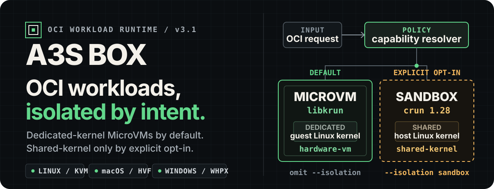

<p align="center">
  
</p>

<p align="center">
  <strong>The local product plane for Linux OCI workloads: Docker-like workflows, typed SDKs, and isolation that never changes behind your back.</strong>
</p>

<p align="center">
  <a href="https://github.com/A3S-Lab/Box/actions/workflows/ci.yml"></a>
  <a href="https://github.com/A3S-Lab/Box/releases/latest"></a>
  <a href="https://pypi.org/project/a3s-box/"></a>
  <a href="https://www.npmjs.com/package/@a3s-lab/box"></a>
  <a href="https://pkg.go.dev/github.com/A3S-Lab/Box/sdk/go/v3"></a>
  <a href="LICENSE"></a>
</p>

<p align="center">
  <a href="#start-with-one-workload">Start</a> ·
  <a href="#choose-the-boundary-intentionally">Isolation</a> ·
  <a href="#what-box-owns">Capabilities</a> ·
  <a href="#one-state-model-four-native-sdks">SDKs</a> ·
  <a href="#platform-status">Platforms</a> ·
  <a href="#architecture-current-and-target">Architecture</a> ·
  <a href="#development">Development</a>
</p>

---

**A3S Box** turns an image, a command, and product policy into a
lifecycle-managed workload on the local machine. It owns the developer
experience and product resources: images, builds, networks, volumes,
snapshots, health, restart policy, logs, and cleanup.

The current 3.2 execution model has two explicit paths:

- omitting `--isolation` selects a dedicated-kernel MicroVM managed by Box
  through libkrun;
- `--isolation sandbox` selects the shared-host-kernel path on a qualified
  Linux host, with lifecycle execution delegated through the pinned
  [A3S OCI Runtime](https://github.com/A3S-Lab/OCI-Runtime) SDK.

There is no silent fallback between them. The request, resolved backend, and
policy are persisted so restart recovery cannot reinterpret the workload.

The runtime crate now also exposes an explicit `OciMigrationPolicy` and
`LocalExecutionBackendRouter` for the phased cutover. New records are stamped
with `box_vm` or `oci_sdk` before capability preflight and persist that choice
with the reservation before launch side effects. Later policy changes cannot
reroute their lifecycle, recovery, or cleanup, and a selected OCI failure is
never retried on the Box backend. On Linux, the CLI, machine bridge, and the
async Rust SDK constructor can now opt new Sandbox records into the production
bundle provider and long-lived pinned runtime owner with
`A3S_BOX_OCI_MIGRATION=sandbox`. With the setting absent, current behavior is
unchanged. Windows x86_64 also has an explicit qualification-only
`microvm`/`all` composition for the externally launched OCI Runtime WHPX
service; it is not enabled by default and is not yet a production claim.

> [!NOTE]
> The current SDK-only Sandbox adapter now covers four exact-generation rails:
>
> - versioned rootfs, mount, network, process-I/O, secret, and extension
>   attachments with a persisted manifest digest;
> - memory-retaining pause/resume plus captured and streaming exec, stdin,
>   cursor-checked output, signal/wait, PTY resize, exact exit status, and
>   bounded timeout cleanup;
> - bounded file upload/download plus filesystem stat, recursive mkdir, move,
>   bounded listing, and recursive removal through descriptor-confined runtime
>   sessions;
> - live process inventory, normalized stats, bounded ordered events, and
>   replay-safe resource updates compiled into one complete OCI contract.
>
> Calls are capability-checked and bound to the exact runtime target. File and
> filesystem mutations reuse one operation identity for an explicitly
> retryable lost response and are verified to take effect once; read responses
> are size-bounded and rejected if the target or shape drifts. Resource intent
> is persisted before mutation and recovered with the same operation identity.
> Snapshot freezer claims also persist whether their runtime mutation has been
> applied, so crash recovery never replays an already completed thaw, while the
> original create identity remains immutable. A retained local SDK client now
> exposes the first broken-stream result, then reconnects and
> renegotiates on a later explicit reconciliation. The generic Box/OCI contract
> also recovers one manager across two distinct runtime-owner test processes
> with exactly one create, start, and exec; the original live process stream and
> input handle continue inventory, stdin, output, signal, wait, and cleanup
> through the replacement owner. Raw runtime output stays separate from
> structured Box logs. The pinned runtime qualification now exercises binary
> file transfer and descriptor-confined mkdir/stat/list/move/remove against its
> real native and utility-VM drivers before the Box SDK suite runs. The pinned
> runtime now supplies a long-lived multi-container Native Linux host owner and
> Box now supplies its production direct-process bundle compiler, protected
> identity-fenced owner startup, and explicit CLI/SDK composition. Before bundle
> construction, the resource guard validates the managed home, durably attaches
> product volumes and networking, and installs a verified snapshot lower with
> fail-closed rollback. Direct SDK argv commands use the effective container
> `PATH` to resolve `argv[0]` against that prepared rootfs before OCI dispatch,
> preserving shell-free `Argv("printf", ...)` behavior without weakening the
> runtime's normalized-absolute-path contract. The blocking Native Linux
> x86_64 and aarch64 real-host lanes now pass this production owner composition
> through the Rust, Python, TypeScript, and Go SDK
> lifecycle, exec, filesystem, route-aware stats, pause/resume, snapshot
> restore, restart, and cleanup surfaces. Both lanes kill the exact
> authenticated OCI owner under a running Sandbox, prove its launcher and init
> identities terminate, and use fresh Box SDK-bridge processes to rebind the
> owner endpoint, reconcile the generation as stopped without inventing an exit
> status, delete its exact runtime tombstone, and restart the next Box and OCI
> generations.
> WHPX production composition, transparent process/filesystem-session recovery
> across real driver-owner death, remaining CLI projections, and the broader
> cutover gates remain open; the default split above is still authoritative.
> Follow the checked gates in the [migration roadmap](ROADMAP.md).

## Start with one workload

Install the stable release on Linux or macOS:

```bash
curl --proto '=https' --tlsv1.2 -fsSL \
  https://raw.githubusercontent.com/A3S-Lab/Box/main/install.sh | sh
```

On Windows x86_64, use PowerShell:

```powershell
irm https://raw.githubusercontent.com/A3S-Lab/Box/main/install.ps1 | iex
```

Open a new terminal if needed, then inspect the exact host capability before
launch:

```text
a3s-box --version
a3s-box info
```

Run a disposable Alpine workload. The omitted isolation flag is intentional:

```bash
a3s-box run --rm alpine:3.20 -- sh -lc 'echo "inside $(uname -s)"; uname -r'
```

Then exercise the familiar long-running lifecycle:

```bash
a3s-box run -d --name web --memory 1g -p 8080:80 nginx:alpine
a3s-box ps
a3s-box logs -f web
a3s-box exec web -- nginx -v
a3s-box stop web
a3s-box rm web
```

The installers verify release SHA-256 values before extraction and reject
unsupported architectures or unsafe replacement targets. Pinned versions,
offline packages, Homebrew, PATH behavior, and uninstall steps live in
[Installation](docs/installation.md).

## Choose the boundary intentionally

| Contract | Default MicroVM | Explicit Sandbox |
| --- | --- | --- |
| Request | omit `--isolation` | `--isolation sandbox` |
| Effective isolation | `hardware-vm` | `shared-kernel` |
| Current execution owner | Box → libkrun | Box → `a3s-oci-sdk` → native Linux service |
| Kernel boundary | Dedicated guest Linux kernel | Shared host Linux kernel |
| Qualified hosts | Linux/KVM, Apple Silicon/HVF, Windows x86_64/WHPX within the platform gates below | Certified Linux x86_64/aarch64 host |
| Best fit | Untrusted workloads and stronger tenant boundaries | Trusted or semi-trusted tools, benchmarks, and automation |
| VM-only features | TEE, warm pool, snapshot-fork where qualified | Rejected |
| Fallback | Never | Never |

An explicit `--isolation microvm` spelling is rejected. Omission is the only
public way to select the default, which prevents scripts from treating backend
names as interchangeable compatibility modes.

On a certified Linux host, request the shared-kernel preview explicitly:

```bash
a3s-box run --rm \
  --isolation sandbox \
  --cpus 2 \
  --memory 512m \
  alpine:3.20 -- sh -lc 'id; cat /proc/self/status'
```

### Opt into the long-lived OCI owner on Linux

The production migration path is deliberately not the default yet. Install the
pinned `a3s-oci` and `a3s-oci-agent` pair, then keep the same configuration in
every process that manages the migrated records:

```bash
export A3S_BOX_OCI_MIGRATION=sandbox
export A3S_BOX_OCI_RUNTIME_PATH=/absolute/path/to/a3s-oci
export A3S_BOX_OCI_AGENT_PATH=/absolute/path/to/a3s-oci-agent
# Optional; the default is a short, per-UID/per-A3S-home directory under /tmp.
export A3S_BOX_OCI_HOST_ROOT=/absolute/private/runtime-root

a3s-box run --rm --isolation sandbox alpine:3.20 -- sleep 5
```

When overriding artifact discovery, both artifact variables must be supplied
together; each executable is capability-probed and SHA-256 fenced before owner
startup and again before bundle mutation. The owner root is created with mode
`0700`; an existing root must be an absolute normalized, real, same-UID
directory with that exact mode. A live owner is reused only when its PID start
identity, endpoint, paths, and digests match. Unknown sockets and drifted
artifacts fail closed.

If this owner is terminated uncleanly, its parent-bound Native Linux process
tree is terminated with it. The next explicit Box operation starts a distinct
identity-fenced owner, treats the authenticated old generation as stopped,
refuses to synthesize an unavailable exit status, removes only that exact
generation, and permits an explicit restart to create the next Box and OCI
generations. This stopped-only crash recovery is qualified on real x86_64 and
aarch64 Linux hosts; it is not transparent continuation of live exec or
filesystem sessions.

Rust applications select the same path with
`A3sBoxClient::with_configured_paths(...).await` or construct
`NativeLinuxOciMigrationConfig` explicitly. The synchronous `new`,
`from_home`, and `with_paths` constructors retain legacy behavior for API
compatibility.

### Exercise the qualification-only WHPX handoff on Windows

Start the pinned OCI Runtime `box-whpx-qualification-service` with its shim,
protected runtime root, utility-VM rootfs, state root, named pipe, and readiness
file. Then configure every Box process that owns the test record:

```powershell
$env:A3S_BOX_OCI_MIGRATION = 'microvm'
$env:A3S_BOX_OCI_HOST_ROOT = 'C:\absolute\a3s-oci-runtime-root'
$env:A3S_BOX_OCI_WHPX_ENDPOINT = '\\.\pipe\a3s-oci-box-qualification'

a3s-box run --rm --cpus 1 --memory 512m --network none alpine:3.20 -- /bin/true
```

For the exact product gate, download the Box `windows-whpx` artifact and the
pinned OCI Runtime `windows-whpx-qualification` and `guest-agents-musl`
artifacts, preserving each artifact's `artifact-manifest.json`, then run:

```powershell
.\scripts\windows-whpx-oci-qualification.ps1 `
  -BoxArtifactDirectory C:\artifacts\box-windows `
  -OciWindowsArtifactDirectory C:\artifacts\oci-windows `
  -OciGuestArtifactDirectory C:\artifacts\oci-agents `
  -RootfsArchive C:\images\alpine-minirootfs-3.22.5-x86_64.tar.gz
```

The runner accepts only artifacts whose source commits match this Box checkout
and its exact OCI pin, requires both OCI bundles to come from one workflow run,
and rechecks every size and SHA-256 digest. It then exercises replay-safe
create, Box-manager reopen, start, wait, exact exit status, and delete through
the named-pipe service on real WHPX. `summary.json` uses schema
`a3s.box.windows-whpx-oci-qualification-run.v1` and records cleanup and process
inventory together with both artifact manifests.

This profile accepts only a fresh writable Linux amd64 rootfs, one vCPU,
512 MiB, `network=none`, and no TEE, host mounts, volumes, devices, sidecars,
Snapshot, custom security controls, or persistence. Box copies the prepared
rootfs into the exact operation-scoped SDK handoff, converts its image metadata
to `a3s.oci.rootfs-metadata.v1`, emits a relative `rootfs` OCI specification
without a user namespace, and atomically publishes the bundle. OCI Runtime
then moves that bundle into the exact WHPX generation share. Missing extension
support or any unqualified option fails before image preparation. The endpoint
must be supplied explicitly so this experimental service can never activate by
accident.

Current Linux opt-in limits are intentional: only new Sandbox reservations are
routed there; `all`/MicroVM migration is rejected on Linux; image-declared
anonymous volumes must be replaced by explicit named or bind mounts; and
remaining socket-based CLI projections (`attach`, `cp`, `top`, `stats`, live
`container-update`, plus init stdout/stderr projection into Box logs) are not
yet promoted on this path.
The typed SDK lifecycle, exec/PTY, file/filesystem, process inventory, stats,
events, resource update, pause/resume, wait, restart, and cleanup contracts do
route through the exact OCI generation.

> [!IMPORTANT]
> A shared-kernel Sandbox does not defend against a working host-kernel
> exploit, a hostile host administrator, hardware side channels, or data
> deliberately exposed through a bind mount. Use the default MicroVM boundary
> when those risks matter.

The complete admission rules and threat model are in
[Host Sandbox Backend Design](docs/host-sandbox-backend-design.md).

## What Box owns

Box is Docker-like, not Docker-identical. Unsupported controls fail before
runtime mutation instead of being stored and silently weakened.

| Product area | Current surface |
| --- | --- |
| Workloads | create, start, stop, restart, kill, pause, wait, inspect, exec, attach, PTY, live process inventory, health, and restart policy |
| Images and builds | pull, push, tag, save/load, verified layers, selected Dockerfile/Containerfile builds, content-addressed cache, and signed-image policy |
| Storage | bind mounts, named volumes, tmpfs, copy, diff, export, commit, filesystem snapshots, and copy-on-write restore |
| Networking and Compose | TSI, named bridges, peer discovery, TCP publication, generation-fenced Runtime Service forwarding on Sandbox and MicroVM, and a bounded ACL/YAML Compose subset |
| Operations | structured logs, normalized runtime stats, ordered events, audit evidence, metrics, monitoring, replay-safe resource updates, and cleanup |
| Acceleration and security | rootfs/layer caches, warm pools, opt-in Linux/KVM snapshot-fork, and host-gated SEV-SNP-oriented workflows |

A few end-to-end workflows:

```bash
# Build and run
a3s-box pull alpine:3.20
a3s-box build -t local/app:dev .
a3s-box run -d --name app local/app:dev

# Durable data and a stopped-filesystem snapshot
a3s-box volume create data
a3s-box run -d --name data-app -v data:/data alpine:3.20 -- sleep 3600
a3s-box stop data-app
a3s-box snapshot create data-app --name checkpoint-1

# Named networking and deterministic Compose normalization
a3s-box network create backend --subnet 10.89.0.0/24
a3s-box compose -f compose.acl config
a3s-box compose -f compose.acl up -d
```

<details>
<summary><strong>CLI command map</strong></summary>

| Area | Commands |
| --- | --- |
| Lifecycle | `run`, `create`, `start`, `stop`, `restart`, `rm`, `kill`, `pause`, `unpause`, `wait`, `rename`, `prune` |
| Execution | `exec`, `shell`, `attach`, `top` |
| Images and builds | `pull`, `push`, `build`, `images`, `rmi`, `tag`, `image-inspect`, `history`, `image-prune`, `save`, `load`, `import` |
| Filesystems | `cp`, `diff`, `export`, `commit`, `volume`, `snapshot` |
| Networking | `network`, `port`, `port-forward`, `compose` |
| Security and TEE | `attest`, `seal`, `unseal`, `inject-secret` |
| Observability | `ps`, `logs`, `inspect`, `stats`, `events`, `df`, `audit`, `monitor` |
| System | `container-update`, `system-prune`, `pool`, `login`, `logout`, `version`, `info` |

</details>

## One state model, four native SDKs

Rust, Python, TypeScript, and Go operate the same local resources and durable
state as the CLI. They do not expose a remote endpoint, domain, or API-key
setting.

| Language | Install | Runtime access | Guide |
| --- | --- | --- | --- |
| Rust | `cargo add a3s-box-sdk` | Direct typed calls into the runtime and generation-fenced execution manager | [Rust SDK](src/sdk/README.md) |
| Python | `python -m pip install a3s-box` | Sync and async APIs over the installed machine bridge | [Python SDK](sdk/python/README.md) |
| TypeScript | `npm install @a3s-lab/box` | Promise APIs over the installed machine bridge; Node.js 20+ | [TypeScript SDK](sdk/typescript/README.md) |
| Go | `go get github.com/A3S-Lab/Box/sdk/go/v3` | Context-aware APIs over the installed machine bridge; Go 1.25+ | [Go SDK](sdk/go/README.md) |

Python, TypeScript, and Go exchange structured protocol-v3 messages with
`a3s-box sdk-bridge`; they never parse human CLI output. The exact
48-operation handshake fails closed on missing, duplicate, malformed, or
incompatible capabilities. See the
[cross-language SDK contract](docs/sdk-api-and-programmable-cicd.md).

The Rust execution contract also exposes `transfer_file`, `filesystem`,
`processes`, `runtime_stats`, `events`, and `update_resources` on the local
Sandbox facade. Each call carries the current Box generation; a backend that
does not advertise the matching runtime operation returns a typed availability
error before dispatch.

## Platform status

| Path | Current evidence | Boundary that remains visible |
| --- | --- | --- |
| Linux MicroVM | Primary local path through KVM/libkrun; all advertised A3S Runtime provider profiles plus self-hosted lifecycle, SDK, CRI, race, leak, snapshot-fork, and soak gates | Full release evidence still requires the enrolled self-hosted KVM runner and the longer `G2`/`R24` profiles |
| macOS MicroVM | Apple Silicon/HVF build and packaging path | Real Apple Silicon/HVF release validation remains a separate host gate; Intel macOS is unsupported |
| Windows MicroVM | Real x86_64 WHPX soak covering lifecycle, exec, copy, stats, ports, bind/named volumes, commit, snapshots, and cleanup | One vCPU; no interactive PTY, bridge networking, TEE, snapshot-fork, or CRI |
| Linux Sandbox | Real A3S OCI Runtime CI profiles plus Rust, Python, TypeScript, and Go SDK exercises through the production owner route | Shared-kernel preview; VM-only controls are rejected |
| Kubernetes | CRI v1 server and containerd runtime-v2 shim preview | Complete CRI conformance is not claimed |
| TEE | SEV-SNP-oriented application and protocol flows | Simulation is not hardware security evidence |

Real-host evidence is deliberately separate from unit, build-only, fixture, or
simulation results. Review [Host Integration](docs/host-integration.md),
[Cross-Capability Soak Tests](docs/soak-test-plan.md), and
[CRI Conformance](docs/cri-conformance.md) before promoting a deployment.

Windows hosts must also follow the [WHPX setup guide](docs/windows-whpx.md).

## Architecture: current and target

Every shipped entry point reaches one backend-neutral local
`ExecutionManager`:

```text
CLI · Rust · Python · TypeScript · Go · Compose · CRI · containerd shim
                                  │
                         ExecutionManager
                  desired state · generations · policy
                    ┌─────────────┴─────────────┐
                    │                           │
         images · builds · storage      isolation resolver
        networks · logs · health        ┌───────┴────────┐
                                       │                │
                           current MicroVM      current Sandbox
                           Box + libkrun        a3s-oci-sdk
                           dedicated kernel    shared host kernel
```

The target dependency direction removes the direct execution split:

```text
A3S Box product plane
        │  prepared OCI bundle + desired isolation
        ▼
a3s-oci-sdk over bounded local IPC
        ▼
A3S OCI Runtime host service
        ├── native Linux driver
        └── KVM / HVF / WHPX utility-VM drivers
```

Box remains the product, image, storage, network, health, and policy owner.
OCI Runtime becomes authoritative for actual process/VM state, raw process
I/O, descriptor-confined workload filesystem access, operation replay, exact
terminal status, driver selection, and runtime cleanup. The adapter retains
only the exact runtime identity, immutable
configuration and attachment digests, endpoint, driver, and isolation evidence
needed to detect recovery drift. Live reads recheck that binding after the SDK
response; resource mutations enter a durable `updating_resources` state before
dispatch and publish the new restart intent only after runtime acknowledgement.
The retained SDK client reports a broken local stream without replaying the
unknown request, then reconnects to the persisted endpoint and renegotiates on
the next explicit retry or reconciliation. The process-boundary contract keeps
that same backend alive while two child owners exchange disk-backed runtime
state, proving exact Box reconciliation and continued use of one live exec
stream without duplicate launch. The migration router stamps its selection
before backend preflight, persists it with the successful reservation, routes
old OCI records from their binding or empty Box endpoint evidence, and never
consults the current rollout policy again for an explicitly routed record.
Solid current behavior and the phased cutover gates are kept separate in
[ROADMAP.md](ROADMAP.md); unfinished migration work is never presented as a
platform capability.

This repository is a local runtime, not a hosted Sandbox control plane. Teams
that need remote orchestration should put an authenticated service in front of
the native SDK rather than treating Box as a network API.

## Repository map

```text
src/core/          policy, protocol types, lifecycle state, logs, and errors
src/runtime/       execution manager, backends, images, storage, networks, pools
src/cli/           a3s-box command-line interface
src/sdk/           native Rust SDK and machine bridge
src/cri/           CRI v1 adapter
src/shim/          current host/guest MicroVM control
src/guest/init/    current guest init and execution service
sdk/               Python, TypeScript, and Go packages
containerd-shim/   RuntimeClass integration
```

## Documentation

- [Product and OCI Runtime migration roadmap](ROADMAP.md)
- [Installation and packaging](docs/installation.md)
- [Host integration and real-runtime validation](docs/host-integration.md)
- [Cross-capability soak plan](docs/soak-test-plan.md)
- [Shared-kernel Sandbox threat model](docs/host-sandbox-backend-design.md)
- [Windows WHPX support](docs/windows-whpx.md)
- [SDK API and programmable CI/CD](docs/sdk-api-and-programmable-cicd.md)
- [Compose normalization](docs/compose-normalization.md)
- [Copy-on-write snapshot-fork](docs/cow-snapshot-fork-design.md)
- [Kubernetes CRI conformance](docs/cri-conformance.md)
- [Changelog](CHANGELOG.md)

## Development

The repository root is orchestration-only. Run Rust checks from `src/`:

```bash
cd src
cargo fmt --all -- --check
cargo test -p a3s-box-core
cargo test -p a3s-box-runtime --lib
cargo test -p a3s-box-cli --test command_coverage
cargo test -p a3s-box-sdk
```

Language packages keep independent test suites:

```bash
cd sdk/python
python -m pip install -e .
python -m unittest discover -s tests

cd ../typescript
npm ci
npm run build
npm test

cd ../go
go vet ./...
go test -race ./...
```

Host-backed MicroVM, Sandbox, networking, build, CRI, and endurance tests need
an explicitly prepared machine and isolated runtime state. Use
[`scripts/host-integration-smoke.sh`](scripts/host-integration-smoke.sh) and
[`scripts/local-sdk-smoke.sh`](scripts/local-sdk-smoke.sh), and retain the
host, backend, image digest, runtime revision, and evidence bundle for release
gates.

## License

A3S Box is available under the [MIT License](LICENSE). Vendored sources,
generated fixtures, SDK packages, and release archives retain the license
metadata shipped with their directories or artifacts.
